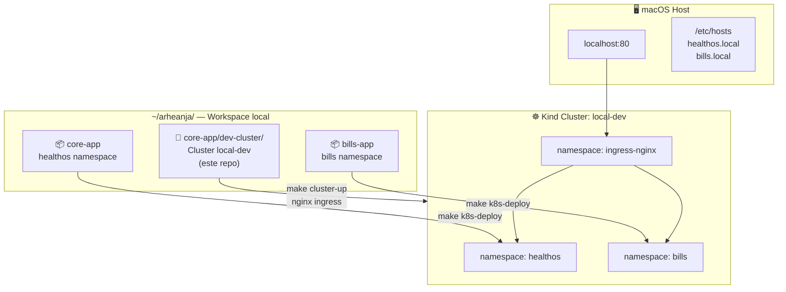
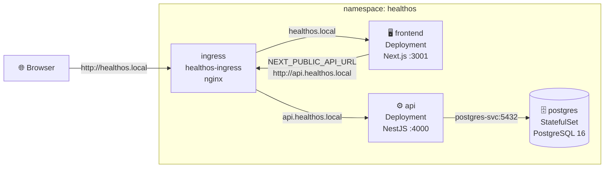
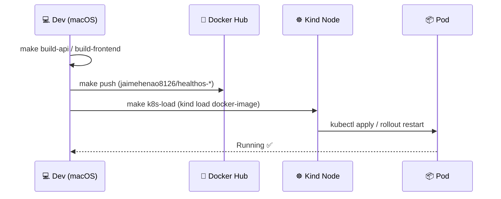
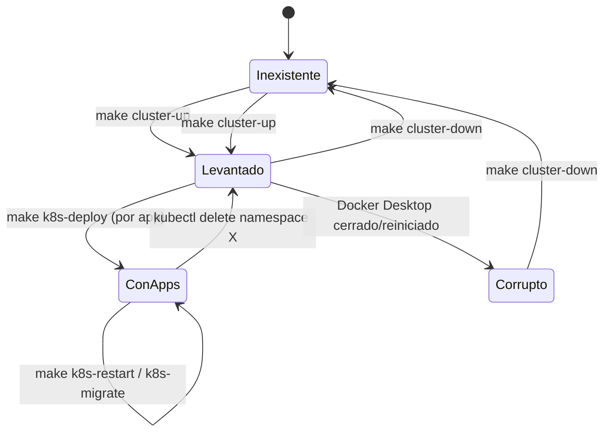

# Guía del Makefile — dev-cluster

> Cluster Kind compartido entre todas las apps del workspace `~/arheanja/`.
> Ubicación: `core-app/dev-cluster/` (parte del repo `core-app`)

---

## Arquitectura

### Visión general del workspace



---

### Arquitectura interna — namespace `healthos`



---

### Flujo de imágenes Docker



---

### Ciclo de vida del cluster



---

---

## Requisitos previos

- [Docker Desktop](https://www.docker.com/products/docker-desktop/) corriendo
- [`kind`](https://kind.sigs.k8s.io/) instalado (`brew install kind`)
- [`kubectl`](https://kubernetes.io/docs/tasks/tools/) instalado (`brew install kubectl`)

---

## Comandos

### `make cluster-up`

Crea el cluster `local-dev` e instala nginx Ingress Controller.

```bash
cd ~/arheanja/dev-cluster
make cluster-up
```

**Qué hace:**
1. `kind create cluster --name local-dev` usando `kind-cluster.yaml`
2. Instala nginx Ingress Controller desde el manifest oficial de Kind
3. Espera a que el pod del controlador esté `Ready`

**Cuándo usarlo:** La primera vez, o después de un `make cluster-down` / reinicio de Docker Desktop.

**Tiempo estimado:** ~60–90 segundos

---

### `make cluster-down`

Destruye el cluster y libera todos los recursos Docker asociados.

```bash
make cluster-down
```

> ⚠️ Esto elimina todos los pods, volúmenes y datos en el cluster. La base de datos se pierde.
> Necesitarás ejecutar `make k8s-migrate` en cada app después de volver a levantar.

---

### `make cluster-status`

Cambia al contexto `kind-local-dev` y muestra nodos y namespaces activos.

```bash
make cluster-status
```

**Output esperado:**
```
NAME                        STATUS   ROLES           AGE
local-dev-control-plane     Ready    control-plane   5m

NAME              STATUS   AGE
default           Active   5m
healthos          Active   3m
ingress-nginx     Active   5m
kube-system       Active   5m
```

---

### `make apps-status`

Vista general de todas las apps desplegadas en el cluster (cross-namespace).

```bash
make apps-status
```

**Output esperado:**
```
=== healthos ===
NAME                            READY   STATUS    RESTARTS   AGE
pod/api-6c74b654d8-xz24m        1/1     Running   0          10m
pod/frontend-6fddc949df-bvht9   1/1     Running   0          10m
pod/postgres-0                  1/1     Running   0          10m

=== bills ===
(not deployed)
```

---

## Flujo completo desde cero

```bash
# 1. Levantar cluster
cd ~/arheanja/core-app/dev-cluster && make cluster-up

# 2. Desplegar HealthOS
cd ~/arheanja/core-app && make k8s-deploy && make k8s-migrate

# 3. Desplegar bills-app (cuando esté lista)
cd ~/arheanja/bills-app && make k8s-deploy && make k8s-migrate

# 4. Ver estado global
cd ~/arheanja/core-app/dev-cluster && make apps-status
```

---

## Namespaces por app

| App | Namespace | Ingress |
|-----|-----------|---------|
| core-app (HealthOS) | `healthos` | `healthos.local` / `api.healthos.local` |
| bills-app | `bills` | `bills.local` / `api.bills.local` (por definir) |

---

## /etc/hosts requerido

Añadir una sola vez:

```bash
# HealthOS
echo "127.0.0.1  healthos.local api.healthos.local" | sudo tee -a /etc/hosts

# bills-app (cuando esté lista)
echo "127.0.0.1  bills.local api.bills.local" | sudo tee -a /etc/hosts
```

---

## Problema común: cluster no arranca tras reinicio de Docker

Si Docker Desktop fue cerrado, el cluster queda en estado `Exited (1)` con error de IP:

```
ERROR: have an old IPv4 address but no current IPv4 address (!)
```

**Solución:**
```bash
make cluster-down   # elimina el cluster dañado
make cluster-up     # lo recrea limpio
```
